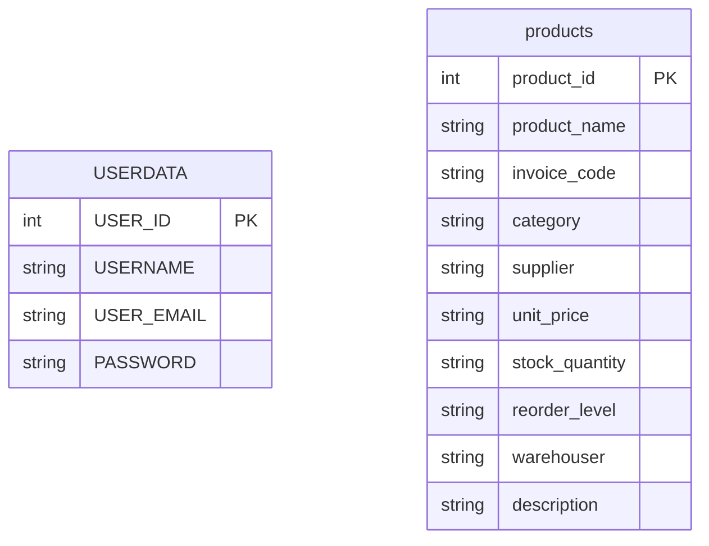

# Inventory Management System

A Java Servlet and JSP based inventory management web application for login, registration, and product stock management. The project uses a MySQL database and JDBC for database access.

## Project Type

This project is a web application built with:

- Java EE / Jakarta Servlet APIs
- JSP pages for UI
- MySQL database
- JDBC connectivity
- Apache Tomcat server
- Eclipse Dynamic Web Project structure

## Screenshots

The project UI screens are shown below:

.png)

.png)

.png)

## Project Objective

The application is designed to:

1. Register a user account.
2. Sign in with email and password.
3. Add inventory products using a product form.
4. Store product and user information in MySQL.
5. Show the inventory dashboard page after login.

## Main Features

- User registration page: `Signin.jsp`
- Login page: `login.jsp`
- Welcome page: `welcome.jsp`
- Product insertion through servlet: `welcome.java`
- User authentication through DAO: `com.logindao.LoginDao`
- Landing page: `index.html`
- About page: `aboutus.jsp`

## Application Flow

1. Open `index.html` from the website.
2. Click `Login` to access `login.jsp`.
3. If the user is new, create a new account from `Signin.jsp`.
4. After successful login, `welcome.jsp` is displayed.
5. Product information can be submitted through the inventory form on the welcome page.
6. The `welcome` servlet saves that product record into the `products` table.

## Project Folder Structure

```text
InventoryManagementSystem/
+-- src/
   +-- main/
       +-- java/
          +-- login.java
          +-- logout.java
          +-- Signin.java
          +-- welcome.java
          +-- com/logindao/LoginDao.java
       +-- webapp/
           +-- index.html
           +-- login.jsp
           +-- Signin.jsp
           +-- welcome.jsp
           +-- aboutus.jsp
           +-- WEB-INF/web.xml
+-- Readme.md
```

## Java Source Files

### 1. `login.java`
A servlet mapped to `/login`.

It receives the email and password from `login.jsp`, calls `LoginDao.check(email, pass)`, and:

- Redirects to `welcome.jsp` on success.
- Redirects back to `login.jsp` if login fails.

### 2. `Signin.java`
A servlet mapped to `/Signin`.

It receives:

- `uname`
- `email`
- `pass`
- `confirmpass`

It validates that the password and confirm password match, then inserts the user into the table `USERDATA`.

### 3. `welcome.java`
A servlet mapped to `/welcome`.

It receives product information from the inventory form on `welcome.jsp`:

- `productname`
- `code`
- `category`
- `supplier`
- `unitprice`
- `stockquantity`
- `reorderlevel`
- `warehouser`
- `desc`

It inserts these values into the MySQL table `products`.

### 4. `logout.java`
A servlet mapped to `/Logout`.

It ends the session and redirects the user to `login.jsp`.

### 5. `LoginDao.java`
The DAO class contains the SQL used for checking a user:

```java
String sql = "select * from USERDATA where USER_EMAIL=? and PASSWORD=?";
```

It connects to the database with MySQL JDBC and validates the user by email and password.

## Database Information

The project uses a MySQL database named `USERS`.

The JDBC connection strings used by the Java files are:

```java
String url = "jdbc:mysql://localhost:3306/USERS";
String username = "root";
String password = "kushalgupta@27";
```

The driver used is:

```java
com.mysql.cj.jdbc.Driver
```

### Database Tables

#### 1. `USERDATA`
Stores the registered users.

Columns:

```sql
USERNAME
USER_EMAIL
PASSWORD
```

The signup servlet inserts into:

```sql
INSERT INTO USERDATA (USERNAME, USER_EMAIL, PASSWORD) VALUES (?, ?, ?)
```

#### 2. `products`
Stores the inventory product data.

Columns used by the `welcome.java` servlet:

```sql
product_name
invoice_code
category
supplier
unit_price
stock_quantity
reorder_level
warehouser
description
```

The insert statement is:

```sql
INSERT INTO products
(product_name, invoice_code, category, supplier, unit_price,
stock_quantity, reorder_level, warehouser, description)
VALUES (?, ?, ?, ?, ?, ?, ?, ?, ?)
```

## Database Setup

You should create the database and tables in MySQL before running the project.

Example setup:

```sql
CREATE DATABASE USERS;
USE USERS;

CREATE TABLE USERDATA (
    USER_ID INT PRIMARY KEY AUTO_INCREMENT,
    USERNAME VARCHAR(100) NOT NULL,
    USER_EMAIL VARCHAR(150) NOT NULL UNIQUE,
    PASSWORD VARCHAR(100) NOT NULL
);

CREATE TABLE products (
    product_id INT PRIMARY KEY AUTO_INCREMENT,
    product_name VARCHAR(150) NOT NULL,
    invoice_code VARCHAR(100) NOT NULL,
    category VARCHAR(100),
    supplier VARCHAR(100),
    unit_price VARCHAR(50),
    stock_quantity VARCHAR(50),
    reorder_level VARCHAR(50),
    warehouser VARCHAR(100),
    description TEXT
);
```

## Database Driver

The project uses the MySQL Connector/J JDBC driver.

Required JDBC dependency can be added through a MySQL connector library such as:

```text
mysql-connector-j
```

When running in Eclipse/Tomcat, make sure the MySQL connector JAR is present in the project classpath or in the server library folder.

## Project Dependencies

The project depends on:

- Java JDK
- Apache Tomcat server
- MySQL server
- MySQL Connector/J JDBC driver
- Servlet and JSP support from Tomcat/Jakarta libraries

## Deployment

The project is configured as a Java web application under the `InventoryManagementSystem` folder.

Expected deployment path:

```text
InventoryManagementSystem/src/main/webapp
```

The `web.xml` file defines the welcome page list and points the app to `index.html`.

## Run Guide

1. Start MySQL.
2. Create the `USERS` database and required tables.
3. Import the project into Eclipse or any Java EE workspace.
4. Configure Tomcat server.
5. Add the MySQL JDBC driver to the classpath.
6. Run the project on Apache Tomcat.
7. Open `index.html` or the project home page through the deployed server.

## Notes

- The current code uses the MySQL password `kushalgupta@27` directly in servlet classes and DAO class.
- In a production environment, this should be moved to an environment variable or secure configuration file.
- The `URL` is configured as `jdbc:mysql://localhost:3306/USERS`.
- The code uses `DriverManager.getConnection(url, username, password)`.

## Database ER Diagram



The project currently uses two primary database tables:

- `USERDATA` for registration and login information.
- `products` for inventory product details such as stock quantity, category, supplier, invoice code, unit price, reorder level, and warehouse.

## Summary

This project is an inventory management web application that allows users to register, log in, and add stock/product records to a MySQL database. It uses Java Servlets, JSP files, and JDBC for database connectivity with MySQL.
